# Deploying a Sample Counter Ink! based Smart Contract on a Substrate Node

To deploy an ink! contract on a substrate node, you can follow these steps:

## Install the required tools:
   - Rust programming language
   - ink! CLI (`cargo install cargo-contract`)
   - We will deploy our code to the tesnet [here](https://polkadot.js.org/apps/?rpc=wss://rpc.testnet.impactprotocol.network)
   - Polkadot JS extension for your browser (for testing and interacting with your contract)

## Create your ink! contract 

   ### Functionality
   #### Here we will be creating a basic counter smart contract that will have the following functionalities
   - increment_counter: This function will increment the value of the counter by 1 there by changing the state of the value in the blockchain
   - decrement_counter: This function will decrease the value of the counter by 1 there by changing the state of the value in the blockchain
   - get_counter: This function will return the existing value of the counter and doesn't change the state of the value.
   ### Creation
   - Go to the terminal or vscode
   - Run the command to Create your contract ```cargo contract new counter```
   - Then go inside the created contract folder ```cd counter```
   - You will see a ```lib.rs``` file and a ```Cargo.toml```
     Please remove the existing code and add the following code snippet in your ```lib.rs``` file 

```rust

#![cfg_attr(not(feature = "std"), no_std)]

#[ink::contract]
mod counter {

    /// Defines the storage of your contract.
    /// Add new fields to the below struct in order
    /// to add new static storage fields to your contract.
    #[ink(storage)]
    pub struct Counter {
     // Storage Declaration
     value: i32,
    }

    impl Counter {
        #[ink(constructor)]
        pub fn new(init_value: i32) -> Self {
            // Contract Constructor
            Self { value: init_value }
        }

        #[ink(constructor)]
        pub fn default() -> Self {
            Self { value: 0 }
        }

        #[ink(message)]
        pub fn get_counter(&self) -> i32 {
            self.value
        }

        #[ink(message)]
        pub fn increment_counter(&mut self) {
            self.value += 1;
        }

        #[ink(message)]
        pub fn decrement_counter(&mut self) {
            self.value -= 1;
        }

    }

}
```
Lets go through whats happening in the above contract
- We have created contract counter and a storage of struct type with a value type i32 (basically a number). 
- Next in the implementation part for the counter struct we have added a default constructor(with a default value as 0) and a new constructor(where it will take a value of type i32 and initialize the contract with that value).
- We have get_counter() method to return the current value of the counter
- We have the increment_counter() method and it increment the value of the counter by 1
- We have the decrement_counter() method and it decrement the value of the counter by 1
 
 ### Add dependencies in your ```Cargo.toml``` file. 
- Now if you look you should have another file in your generated contract folder as ```Cargo.toml```, it is basically where we specify our dependenciees
- It should already have the minimum requirement to compile the contract but if not, copy the below content in there

```rust

[package]
name = "counter"
version = "0.1.0"
authors = [<your_email>]
edition = "2021"

[dependencies]
ink = { version = "4.0.0-beta", default-features = false }

scale = { package = "parity-scale-codec", version = "3", default-features = false, features = ["derive"] }
scale-info = { version = "2.3", default-features = false, features = ["derive"], optional = true }

[lib]
name = "counter"
path = "lib.rs"
crate-type = [
	# Used for normal contract Wasm blobs.
	"cdylib",
]

[features]
default = ["std"]
std = [
    "ink/std",
    "scale/std",
    "scale-info/std",
]
ink-as-dependency = []

```

### Add tests in your contract and your contract file(lib.rs) should look like this

```rust

#![cfg_attr(not(feature = "std"), no_std)]

#[ink::contract]
mod counter {

    /// Defines the storage of your contract.
    /// Add new fields to the below struct in order
    /// to add new static storage fields to your contract.
    #[ink(storage)]
    pub struct Counter {
     // Storage Declaration
     value: i32,
    }

    impl Counter {
        #[ink(constructor)]
        pub fn new(init_value: i32) -> Self {
            // Contract Constructor
            Self { value: init_value }
        }

        #[ink(constructor)]
        pub fn default() -> Self {
            Self { value: 0 }
        }

        #[ink(message)]
        pub fn get_counter(&self) -> i32 {
            self.value
        }

        #[ink(message)]
        pub fn increment_counter(&mut self) {
            self.value += 1;
        }

        #[ink(message)]
        pub fn decrement_counter(&mut self) {
            self.value -= 1;
        }

    }

    /// Unit tests in Rust are normally defined within such a `#[cfg(test)]`
    /// module and test functions are marked with a `#[test]` attribute.
    /// The below code is technically just normal Rust code.
    #[cfg(test)]
    mod tests {
        /// Imports all the definitions from the outer scope so we can use them here.
        use super::*;

        /// We test if the default constructor does its job.
        #[ink::test]
        fn default_works() {
            let counter = Counter::default();
            assert_eq!(counter.get_counter(), 0);
        }

        /// We test a simple use case of our contract.
        #[ink::test]
        fn increment_works() {
            let mut counter = Counter::new(1);
            assert_eq!(counter.get_counter(), 1);
            counter.increment_counter();
            assert_eq!(counter.get_counter(), 2);
        }

        /// We test a simple use case of our contract.
        #[ink::test]
        fn decrement_works() {
            let mut counter = Counter::new(1);
            assert_eq!(counter.get_counter(), 1);
            counter.decrement_counter();
            assert_eq!(counter.get_counter(), 0);
        }
    }

}

```
 
## Compile and Build your contract
  
   - Run the command from your contract folder ```cargo contract build```
   - You will see a target folder generated with the artifacts which you will be needing in the next step, the artifacts are shown below
     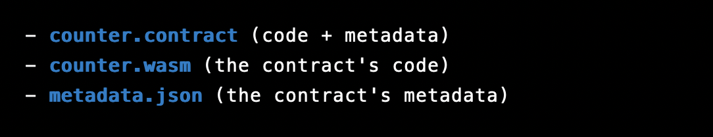
  
## Deploying your contract on the impact chain 

   - Open the Polkadot JS UI in your browser and connect it to your local node or you can directly go [here](https://polkadot.js.org/apps/?rpc=wss://rpc.testnet.impactprotocol.network) for deploying in our testnet

   - In the "Developer" section of the UI, click on "Contracts" and then you will redirected to Contract upload page where you can see any existing contracts that is being uoloaded in the chain. To Deploy your contract click on the ```Upload & Deploy Code``` button
     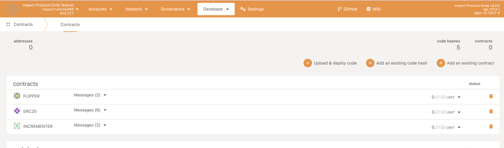
   
   - You will see a popup asking the metadata json file, select the json file from your contract located in the `target/ink` directory(as shown above) by clicking on the "Choose File" button.
    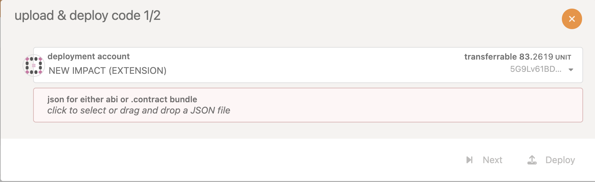

   - Next it will ask for the compiled WASM contract file the "Upload WASM" page, select the compiled Wasm file from your contract located in the `target/ink/` directory by clicking on the "Choose File" button. 
     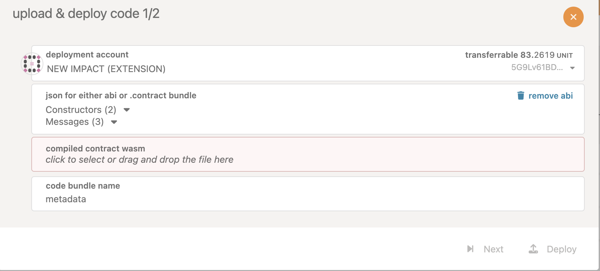

   - Click on "Next" button and you can choose the contructor if you have multiple to initialize your contract
      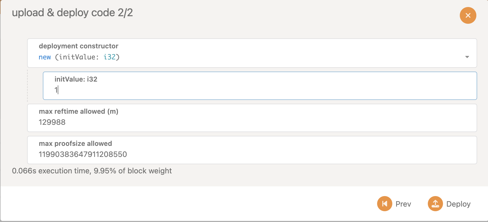

   - Click on "Deploy" to deploy your contract. You will be prompted to sign and submit. Check the account you want to deploy from and click ```Sign and Submit```
    <br/><br/>
    <br/>
    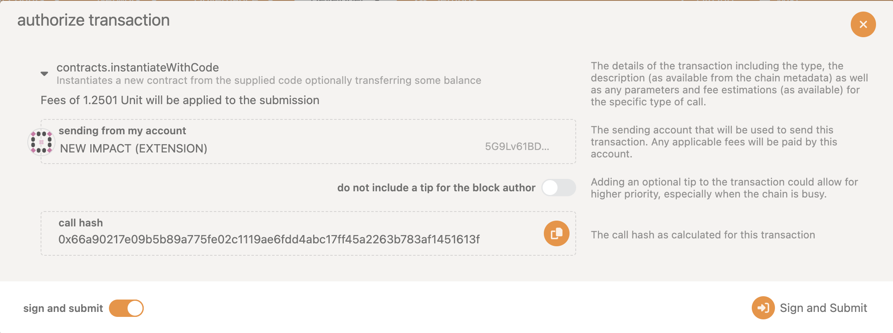
    <br/><br/>
   - Check your contract deploying and once its deployed in the explorer 
    <br/><br/>
    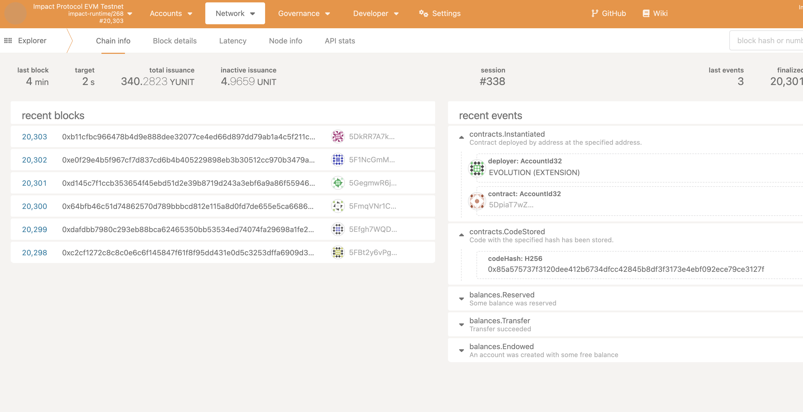
    <br/><br/>
   - Once the contract is deployed, you can see it contracts dashboard.
    <br/><br/>
  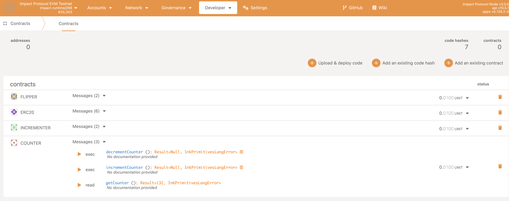
    <br/><br/>

   - From there, you can view information about your contract, such as its storage and calls. You can now try to test the get, increment and decrement methods from the ```counter``` Contract. Lets try to all the get method here
    <br/><br/>
    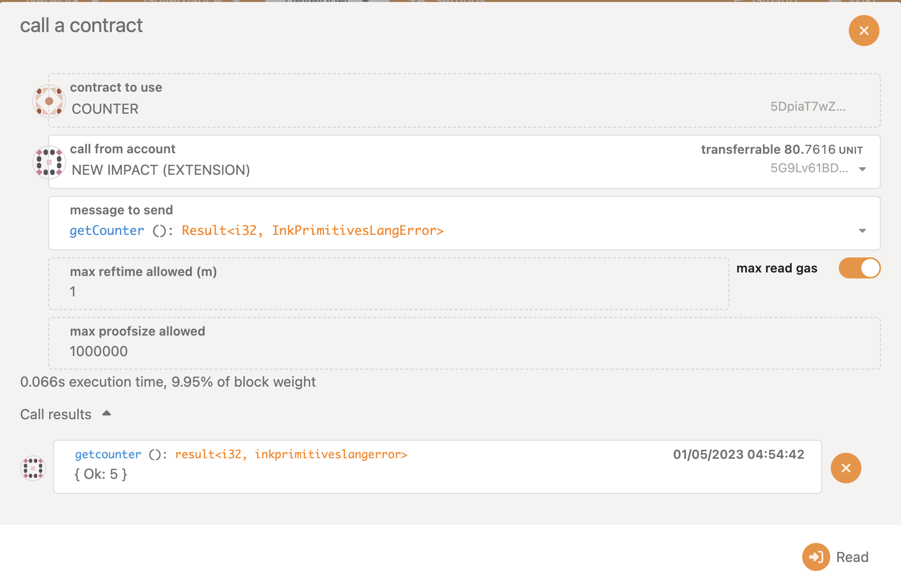
     <br/><br/>
     You can see the value as 5

   - Now lets try to call the increment method from the ```counter``` Contract.
    <br/><br/>
    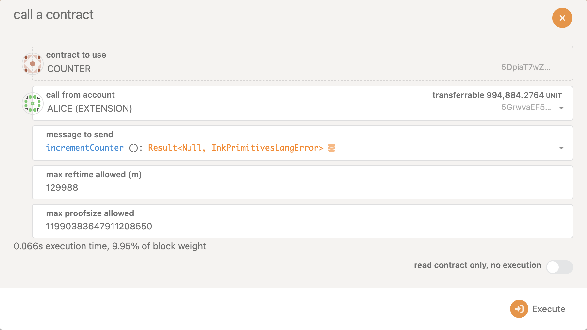
     <br/><br/>
     Lets read the value again and see 
     <br/><br/>
     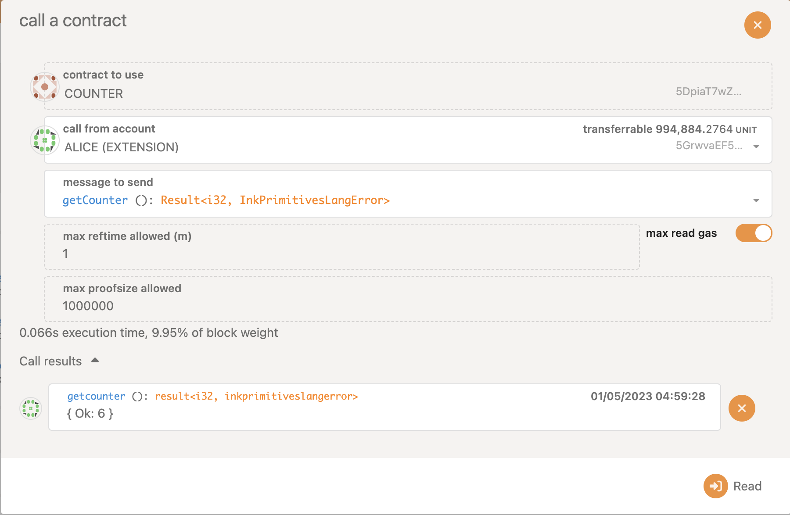
    <br/><br/>
     You can see the value has increased to 6
    <br/><br/>
That's it! Congratulations you've successfully deployed an ink! contract on a substrate node(here in this case impact chain) using the UI and interacted with it
 
   
   
   
